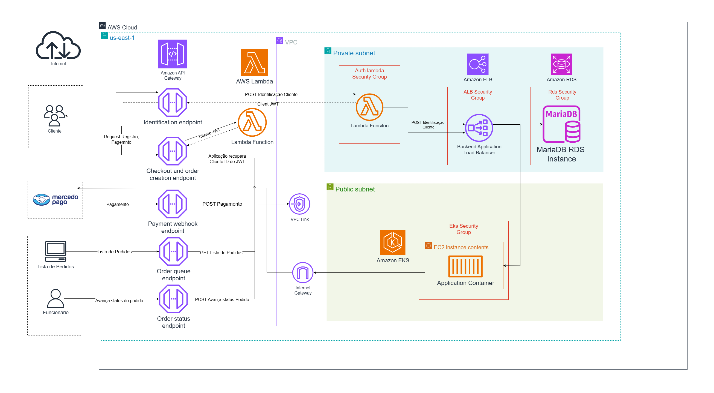

# Tech Challenge - Fase 4

---

## Integrantes do grupo:

- Jose Augusto dos Santos- RM 361650
- Nathalia Matielo Rodrigues- RM 363100
- Rogerio Inacio Silva Junior- RM 364104
- Vanessa Moreira Wendling - RM 362741

---

## 📦 Funcionalidades Entregues na Fase 4

- Criação do microsserviço de pagamentos
- Implementação do banco de dados NoSql DynamoDb para registro dos pagamentos
- Comunicação com os demais serviços via chamada direta
- Implementação de um caminho de teste com BDD
- Cobertura de testes superior a 80% (Segue evidência abaixo)
- Branches Main/Master protegidas
- Deploy automatizado via CI/CD
---

## 💡 Solução Proposta

Foi desenvolvido um sistema de autoatendimento para fast food, que:

- Permite que o cliente faça pedidos diretamente via interface, podendo se identificar por CPF, cadastrar-se ou permanecer anônimo.


- O cliente pode montar o combo em etapas opcionais: Lanche, Acompanhamento e Bebida, com exibição clara de nome, descrição e preço.


- Possui integração com Mercado Pago via QRCode para pagamento.


- Exibe para o cliente um monitor de acompanhamento do pedido, com status atualizados em tempo real: Recebido, Em preparação, Pronto e Finalizado.


- Notifica o cliente quando o pedido estiver pronto para retirada.


- Permite ao estabelecimento gerenciar clientes, produtos e acompanhar os pedidos em andamento.


---

##  Arquitetura


Link para consulta: https://drive.google.com/file/d/1lbuXFyJ4u4rDfE4sO1hEmubwgqLQ72TT/view?pli=1

### Requisitos contemplados

- Escalabilidade e alta disponibilidade com Kubernetes.
- Segurança e gerenciamento de configuração via Secrets e ConfigMaps.
- Visibilidade e controle total via painel administrativo.

---


## 📚 DDD

Conheça o DDD do nosso projeto no link: https://miro.com/app/board/uXjVI9DOubQ=/

---

##  Modelagem de dados


Conheça nosso ADR Banco de Dados no link: https://miro.com/app/board/uXjVJBOnVMI=/?share_link_id=499165686840. Lá você irá encontrar todas as informações sobre a escolha do nosso banco de dados, além de detalhamento dos modelos conceitual, fisico e logico.


---

## 🎥 Vídeo Demonstrativo

Assista ao vídeo com demonstração do funcionamento da aplicação e da arquitetura: https://youtu.be/EeZ09IW9S-Y


---

## ⚙️ Tecnologias Utilizadas

- Java 17
- Spring Boot
- Kubernetes 
- DynamoDb
- Mercado Pago (integração de pagamento via QRCode)
- Terraform
- Github Actions

---

## 🚀 Como Executar Localmente

1. Instale JDK 17 e Maven.
2. Clone o repositório:
    ```bash
    git clone https://github.com/SOAT-FIAP-GROUP/SOAT_Pagamentos.git
    cd SOAT_Pagamentos
    ```
3. Crie o banco de dados DynamoDB via terraform
   
4. Execute a aplicação via Maven:
    ```bash
    mvn spring-boot:run
    ```
5. Acesse a documentação Swagger:
    ```
    http://localhost:8082/swagger-ui/index.html
    ```
## 🚀 Como Executar via Kubernetes
1. Instalar Kubernetes com Minikube, ou
2. Instalar Docker Desktop e ativar Kubernetes
    - Se estiver usando **Minikube** habilite o metrics-server (necessário para HPA funcionar):
    ```bash
    minikube addons enable metrics-server
    ```
    - Aplique os manifetos YAML:
    ```bash
    kubectl apply -f k8s/
    ```
    - **Se estiver usando Minikube:**
    ```bash
    minikube service pagamento-service
    ```

   Esse comando deve abrir automaticamente uma aba no navegador com a URL.  
   Acesse `.../swagger-ui/index.html` no final da URL para ver a documentação dos endpoints.

    - **Se estiver usando Docker Desktop:**

   Acesse diretamente no navegador:

    - http://localhost:30000/
    - http://localhost:30000/swagger-ui/index.html

   Neles você poderá visualizar a documentação interativa (OpenAPI/Swagger) dos endpoints disponíveis.

    - Endpoints para Health Checks:
        - Liveness Probe:
      ```bash
      /actuator/health/liveness
      ```
        - Readiness Probe:
      ```bash
      /actuator/health/readiness
      ```

---

## 📚 Endpoints e Exemplos


#### 🔍📚 Collection API (Postman)

Para ter acesso aos Endpoints e exemplos faça o download da collection e importe na sua IDE de preferência:
[Collection API](https://drive.google.com/uc?export=download&id=1xp52ZV3tcdlxPq5wG7C6tpEA4O6jXKvB)

### 💳 Pagamento

#### 🧾 Gerar QR Code de pagamento

**POST** `/api/pagamento`

**Body:**
```json
{
  "OrderId": 3,
  "TotalAmount": 10.000000,
  "Itens": [
    {
      "Codigo": 3,
      "quantidade": 2,
      "Valor": 5.000000
    }
  ]
}

```

**Resposta:**
```json
{
  "data": {
    "in_store_order_id": "a0eae50a-e0a6-4d08-8d5b-b7e4bcf79304",
    "qr_data": "00020101021243650016COM.MERCADOLIBRE020130636a0eae50a-e0a6-4d08-8d5b-b7e4bcf793045204000053039865802BR5913Andrew Soares6009SAO PAULO62070503***63040655"
  },
  "errors": [],
  "success": true
}
```

#### 🧾 Efetivar Criação do QR Code de Pagamento

**POST** `https://api.mercadopago.com/v1/payments`

**Body:**
```json
{
  "transaction_amount": 10,
  "payment_method_id": "pix",
  "description": "Compra de teste QR",
  "external_reference": "3",
  "installments": 1,
  "payer": {
    "first_name": "Teste",
    "last_name": "User",
    "email": "email@gmail.com"
  }
}

```

**Resposta:**
```json
{
  "id": 1323573924,
  "date_created": "2025-06-02T23:49:17.258-04:00"
} 
```

#### ✅ Webhook - confirmação de pagamento

**POST** `/webhook/mercadopago/confirmapagamento`

**Body:**
```json
{
  "id": "1323573924",
  "live_mode": false,
  "type": "payment",
  "date_created": "2025-05-22T12:54:53Z",
  "user_id": 17679366,
  "api_version": "v1",
  "action": "payment.created",
  "data": {
    "id": "1323573924"
  }
}
```

**Resposta:**
```json
{
  "data": null,
  "errors": [],
  "success": true
}
```

#### 🧾 Consultar pagamento

**GET** `/api/pagamento?id=1340035121`

**Resposta:**
```json
{
  "pedidoId": "1",
  "mercadoPagoIdPagamento": 1340035121,
  "status": "pending"
}
```
---


